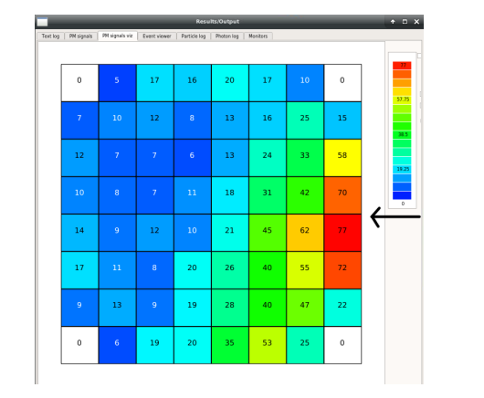

# Radioactive source emission direction estimation using a cylindrical NaI detector and MVA techniques
<h2>Required Python Packages</h2>

    The Python code requires the following packages. You can install them using <code>pip</code> by running the command:

<pre><code>pip install -r requirements.txt</code></pre>

    Alternatively, you can install each package individually using the following commands:

<ul>
    <li><code>numpy</code> - For numerical operations</li>
    <li><code>scipy</code> - For scientific computing</li>
    <li><code>matplotlib</code> - For plotting graphs and visualizations</li>
    <li><code>pandas</code> - For data manipulation and analysis</li>
    <li><code>scikit-learn</code> - For machine learning tools</li>
</ul>

    Make sure to install these packages in the same environment where you plan to run the code. If you encounter any issues, refer to the package documentation or seek help from the community.

<h2>Installation Instructions</h2>

    1. Clone the repository:

<pre><code>git clone https://github.com/your-repo-name/gamma-ray-360-detection.git</code></pre>

    2. Navigate to the project directory:

<pre><code>cd gamma-ray-360-detection</code></pre>

    3. Install the required packages:

<pre><code>pip install -r requirements.txt</code></pre>

    For detailed instructions and troubleshooting, refer to the <a href="https://github.com/your-repo-name/gamma-ray-360-detection">repository's documentation</a>.

## Abstract
In this thesis, the study of spatial directional emission of radioactive radiation
is analyzed, using a NaI(Tl) detector for isotopes of different energy strikes. In
particular, 8x8 and 12x12 SiPM arrays (Silicon PhotoMultiplier) are placed at the
bottom of the cylindrical NaI crystal, on which gamma-ray photons were incident via
ANTS2 software.

Moving forward, by applying the analytical method of weighted vector to silicon
photomultipliers (SiPM), the direction of the source - isotope that radiates isotropically
in space, can be determined easily, reliably and with great accuracy. Based
on the aforementioned analytical method, a python program was implemented to
calculate the maximum source directivity for each isotope, using functions that visualize
the distributions of visible photons in the NaI crystal and provide details on
each step of implementation.

The isotopes studied and finally simulated are: 57Co
 with characteristic gamma photopeaks at 122 keV and 136 keV , 137Cs with characteristic gamma photopeak
of 662 keV and 60Co with characteristic gamma photocurves of 1173 keV and 1332
keV. The isotopes were each placed separately, at a distance of one meter (1 m)
from the detector array (the SiPM array and NaI crystal arrays) and thirty-six (36)
measurements were simulated for each isotope at 10 degrees in azimuth, spatially
covering an entire circle.

Radioactive isotopes with characteristic low and high photopeaks energy were
deliberately used to observe it:

1. how the accuracy of determining the azimuthal emission angle is affected as
the energy of the emitted g-photons increases,
2. the optimal accuracy of determining the azimuthal emission angle that can be
achieved with these geometric configurations for all isotopes, especially those
with the highest energy such as 60Co,
3. which layout of the two (8x8 SiPM layout or 12x12 SiPM layout) achieves the
best accuracy of determining the azimuthal emission angle for a given number
of events, equivalent to a given exposure time

## ANTS2 Simulation

ANTS2 is a software for simulation and data processing for Anger Camera-type detection sensors. 
It is based on the ROOT data processing software, which was developed at the European Organization for Nuclear Research (CERN). 
The software can simulate radioactive sources and their interactions with scintillation detectors. Additionally, it has the capability 
to simulate signals from photosensitive sensors, such as photomultiplier tubes (PMTs) and silicon photomultipliers (SiPMs).

### Data input into ANTS2

The configuration of the detector's characteristics can be saved, loaded, or transmitted to the primary 
structure using JSON (JavaScript Object Notation) files.The simulation module performs Monte Carlo simulations
for each gamma photon in the detector, based on the provided settings. By selecting the advanced options, we 
choose the type of radioactive isotope we want to study, assuming it emits radiation isotropically.

### Characteristics of the Detector

Initially, we define the scintillation detector, its geometry, and its type. We have selected a NaI detector with the following geometric characteristics:

- Outer diameter: 51.5 mm (2”)
- Cylinder height: 76.5 mm (3”)

This specific type and geometry is a very common type of scintillation detector that can be found easily and affordably in the market. 
Next, we place the SiPM detector at the bottom of the cylinder, forming a 12x12 two-dimensional array with the following geometric characteristics:

- Square dimensions: 3 mm x 3 mm
- Thickness: 0.1 mm
- Center-to-center distance: 4.2 mm
- PDE (Photon Detection Efficiency): 0.41

Another type of SiPM is the 8x8 two-dimensional array with the following geometric characteristics:

- Square dimensions: 6.07 mm x 6.07 mm
- Thickness: 0.1 mm
- Center-to-center distance: 6.13 mm
- PDE: 0.5

  
   
  <i>Visualization of a cylindrical NaI detector in the ANTS2 program. The silicon photomultipliers are positioned at the bottom of the cylinder in a 12x12 array, covering the diameter of the detector</i>

### Simulation Results 
 One final parameter specified for the simulation of the interaction of the detection setup with the gamma photons is the number of gamma photons to be emitted from the source. The execution time of the simulation varies depending on the processing power of the respective computer.

The results of the simulations are a two-dimensional matrix with dimensions (m x n). The dimension 'm' is equal to the number of gamma photons (events) that have been input into the program, while the dimension 'n' is equal to the number of SiPMs in the array. For example, simulating the interaction of 10,000 gamma photons of the  57Co isotope with the crystal in an 8x8 SiPM array, the final file will contain a two-dimensional matrix with dimensions (10,000 x 64). Finally, each cell of the matrix contains the number of photons detected by each SiPM photomultiplier, representing its weight. This matrix can be saved in .root, .dat, or .txt file formats.

The distribution of scintillation photons resulting from the interaction of a single gamma photon of the  57Co isotope with the crystal, with phi = 0°.

The following observations are made:

- Most photons are detected on the right side of the detector. However, a certain number of scintillation photons are distributed across all SiPMs in the detector,
  making it challenging to precisely determine the direction of the point source in these configurations. This highlights the difficulties and the algorithms that need to be developed to accurately determine the direction of the point source in these arrangements.
- The SiPM photomultipliers located at the corners do not detect photons due to the cylindrical geometry of the scintillation detector and the square geometry of the SiPM array
  

  
   
  <i>Distribution of scintillation photons in a 12x12 SiPM array for the 57Co isotope with the 'true' emission angle of the isotope (phi = 0°). On the right, the direction of the gamma radiation is indicated by the black arrow</i>

## Source emission direction estimation
### Event Isolation of photopeak

To determine the source in space, only gamma photons that contribute to the characteristic photopick are utilized. As shown in Table 5.1, for each isotope, a different percentage of the initial gamma photons ultimately contribute to the photopeak.

  
   
  <i> Depiction of the studied isotopes with their characteristic gamma photopick energies and the final percentage of gamma photons contributing to these</i>

### Calibration Factors
The initial energy of the gamma photon can be calculated based on the total number of detected photons (counts). This energy is obtained by multiplying the total number of photons by appropriate factors, known as calibration factors. These factors, taking into account internal losses (internal NaI crystal efficiency, electronic losses), more accurately determine the initial energy of the gamma photons interacting with the crystal.

The calibration factors are determined by measuring the detector’s response to known gamma photon sources and comparing the results with expected values. Subsequently, these factors are used to correct any deviations in the detector’s response and to accurately determine the energy of the gamma photons. These factors are independent of the isotopes being simulated and are related solely to the arrangement of the SiPM photomultipliers.

If counts &gt; 1000: <code>&gamma;Einitial = 0.8301 + 0.08791 &middot; counts + 5.828 &times; 10-8 &middot; counts2</code> 
 

If counts &lt; 1000: <code>&gamma;Einitial = 14.061 + 0.08333 &middot; counts + 3.213 &times; 10-7 &middot; counts2</code> 

### Vector Centroid Method

Utilizing the characteristics of the SiPM photomultipliers, a vector is generated that starts from the origin (x0, y0) = (0, 0) and points to the location (xw, yw). The slope of the vector is defined as the angle formed between the positive x-axis and the azimuth of the emission angle.

#### Determining (xw, yw)

To determine the position (xw, yw) of the interaction of a gamma photon in the crystal, the individual calculations for xw and yw are required.

  
   

where:
- \( n \): the number of SiPM elements in a row of the two-dimensional array, i.e., \( n = 12 \) for a 12x12 SiPM array and \( n = 8 \) for an 8x8 SiPM array,
- \( w_i \): the statistical "weight" of the individual SiPM photomultiplier, i.e., the number of scintillation photons detected,
- \( x_i \): the x-coordinate of the center of the corresponding SiPM element,
- \( y_i \): the y-coordinate of the center of the corresponding SiPM element.

## Results

### SiPM 8x8 Array

  
   
  <i> The resolution chart of the quantity ∆φ for the 8x8 SiPM array of the 57Co isotope is shown. For simplicity, only the bar histogram corresponding to 3,500 gamma photons is displayed, along with its corresponding Gaussian fit. Similarly, Gaussian fits were produced for the other cases.
It is observed that as the number of gamma photons increases, the resolution of the detection system improves until it reaches a limiting value, beyond which further improvement is minimal.</i>

  
   
  <i> The resolution plot of the quantity ∆φ for the 8x8 SiPM array of the 137Cs isotope is shown.</i>

  
   
  <i>The resolution plot of the quantity ∆φ for the 8x8 SiPM array of the 60Co isotope is shown.</i>

  
   
  <i>Accuracy plot for Determining the Azimuthal Angle versus Number of Gamma Photons for the 12x12 SiPM Array of the Isotopes 57Co , 137Cs , and 60Co  </i>

### Conclusions

Defining the resolution of the detection system as the angular deviation that the detection system calculates from the actual radiation angle of the radioactive isotope, it is clear that this value should be as small as possible.

It is observed:

- The negative slope of the curves indicates that the resolution significantly improves with the increase in the number of gamma photons emitted from the source and collected at the photopeak.
- The different slopes of the curves suggest that the resolution varies for each isotope; specifically, isotopes with lower emission energy have better determination of their azimuthal angle.
- The resolution value "drops" to a limiting value beyond which it changes very little as the number of gamma photons increases. The saturation point is different for each isotope and is directly related to the gamma photopeak energy.
- The resolution does not show a significant dependence on the choice of the SiPM array.

### Scalability

The above methodology for determining a radioactive source in space can also be applied in the case of multiple sources radiating from different positions, provided that their gamma photopeaks do not overlap.

In such cases, a continuous spectrum is expected without distinct Compton regions and Compton peaks for each isotope, as the isotope with higher energy will contribute gamma photons to lower energies.

Consider the scenario where a NaI detector with an 8x8 SiPM array is placed in the center of a room and three sources are radiating simultaneously from a distance \( R = 1 m \):

- 57Co with characteristic gamma photopeaks (E = 122 keV, 136 keV), radiating from an angle \( phi = 20&deg;)
- 137Cs with characteristic gamma photopeak (E = 662 keV), radiating from an angle \( phi = 90&deg;)
- 60Co with characteristic gamma photopeaks (E = 1173 keV, 1332 keV), radiating from an angle \( phi = 260&deg;)

  
   
  <i> The deviations ∆φ of the azimuthal angle for each isotope detected by the NaI crystal in an 8x8 SiPM array setup  </i>

